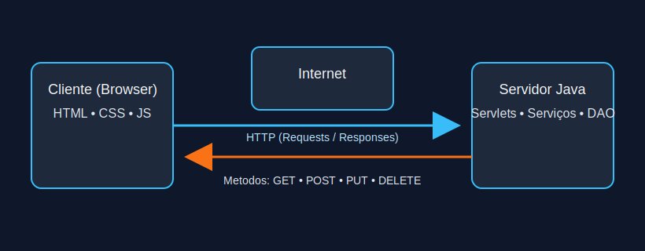
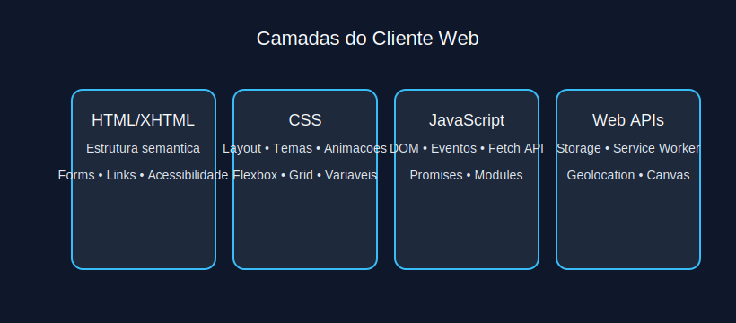
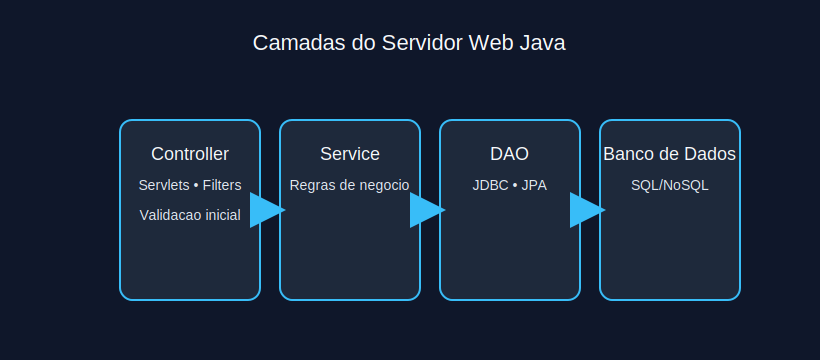
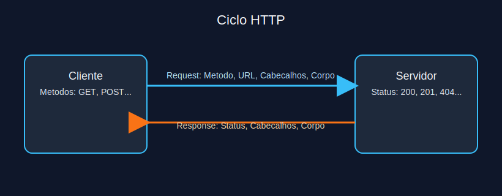
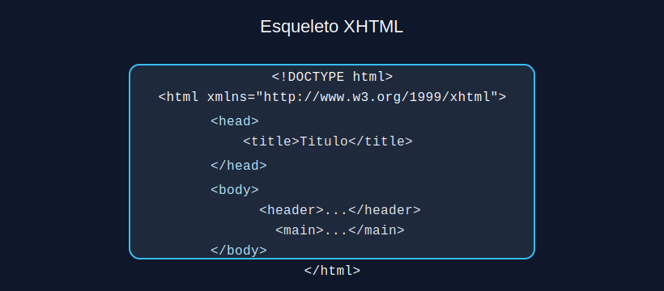
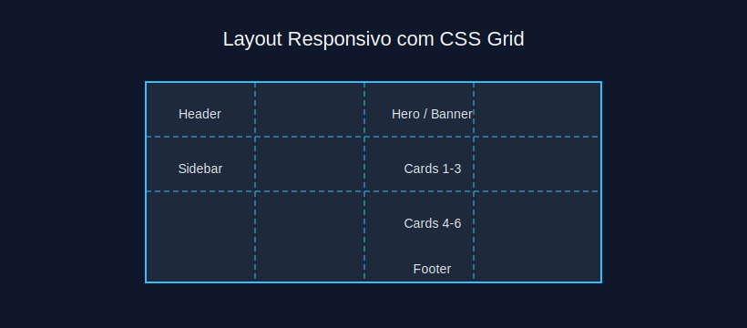
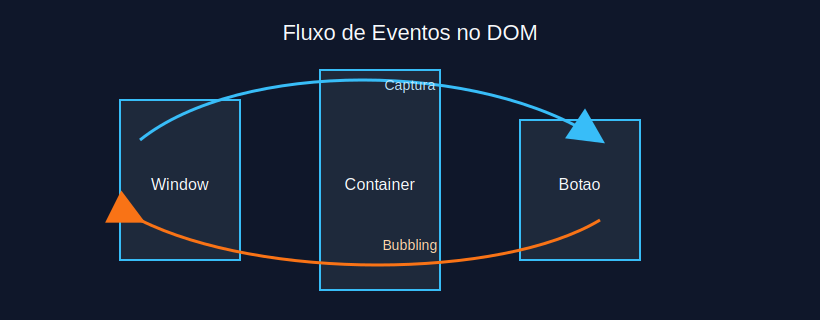

# Modulo 1 - Aplicacao Web e Tecnologias do Lado Cliente

## Sumario Navegavel
- [Introducao ao Modulo](#introducao-ao-modulo)
- [1. Aplicacao Web](#1-aplicacao-web)
  - [1.1 Arquitetura e Funcionamento](#11-arquitetura-e-funcionamento)
  - [1.2 Cliente Web](#12-cliente-web)
  - [1.3 Servidor Web](#13-servidor-web)
  - [1.4 Protocolo HTTP](#14-protocolo-http)
- [2. Tecnologias do Lado Cliente](#2-tecnologias-do-lado-cliente)
  - [2.1 Marcacao XHTML](#21-marcacao-xhtml)
  - [2.2 Estilos CSS](#22-estilos-css)
  - [2.3 Scripts JavaScript](#23-scripts-javascript)

## Introducao ao Modulo
Este modulo apresenta a estrutura essencial de uma aplicacao web moderna, destacando o ciclo cliente-servidor e as principais tecnologias executadas no navegador. Ao final, voce sera capaz de identificar componentes criticos, compreender o funcionamento do protocolo HTTP e organizar a camada de apresentacao com XHTML, CSS e JavaScript.

## 1. Aplicacao Web

### 1.1 Arquitetura e Funcionamento
Aplicacoes web sao sistemas distribuidos que utilizam o modelo cliente-servidor. O cliente (navegador) envia requisicoes HTTP para o servidor, que processa as regras de negocio e retorna respostas estruturadas (geralmente HTML) renderizadas no navegador. Essa interacao depende de camadas bem definidas (apresentacao, logica, dados) para garantir escalabilidade e manutencao.



**Exercicio 1.1:** Qual afirmacao descreve corretamente o papel do cliente em uma aplicacao web tradicional?
a) Processar regras de negocio e persistir dados diretamente no banco

b) Renderizar a interface, executar scripts locais e enviar requisicoes ao servidor

c) Gerenciar filas de mensagens entre microservicos

d) Oferecer APIs REST externas para outros sistemas

<details>
<summary>Ver Resposta</summary>

**Resposta:** b) Renderizar a interface, executar scripts locais e enviar requisicoes ao servidor

**Explicacao:** O cliente (navegador) recebe a resposta do servidor, renderiza a interface e executa scripts fornecidos, alem de iniciar novas requisicoes. As regras de negocio e persistencia normalmente permanecem no servidor.
</details>

### 1.2 Cliente Web
O cliente web representa todo o ambiente executado no navegador: HTML/XHTML para estrutura, CSS para apresentacao e JavaScript para comportamento. Recursos adicionais, como Service Workers e Web Storage, trazem capacidades offline e armazenamento local. Garantir compatibilidade e desempenho do lado cliente exige validacoes, manipulacao de DOM e otimizacoes de carregamento.



**Exercicio 1.2:** Qual recurso do navegador auxilia na construcao de apps com suporte offline?
a) JDBC

b) Service Workers

c) Servlet Filters

d) CRON jobs

<details>
<summary>Ver Resposta</summary>

**Resposta:** b) Service Workers

**Explicacao:** Service Workers interceptam requisicoes, permitem cache customizado e operacoes offline. JDBC e Servlet Filters residem no servidor, enquanto CRON jobs automatizam rotinas em ambientes de backend.
</details>

### 1.3 Servidor Web
O servidor web gerencia requisicoes HTTP, aplica logica de negocio, acessa bancos de dados e consolida respostas para o cliente. Ele pode ser composto por diferentes camadas (controladores, servicos, repositorios) ou ainda dividir responsabilidades entre varios microservicos. Tecnologias como servlets, filtros e listeners compoem o nucleo da plataforma Java EE para web.



**Exercicio 1.3:** Qual responsabilidade pertence tipicamente ao servidor?
a) Validar campos com JavaScript e atualizar o DOM

b) Aplicar regras de negocio, integrar com bancos e montar respostas

c) Gerenciar o layout responsivo via CSS Grid

d) Renderizar animacoes com CSS transitions

<details>
<summary>Ver Resposta</summary>

**Resposta:** b) Aplicar regras de negocio, integrar com bancos e montar respostas

**Explicacao:** O servidor centraliza regras de negocio e integra fontes de dados antes de retornar a resposta ao cliente. Manipulacao de DOM e layout sao tarefas tipicamente do lado cliente.
</details>

### 1.4 Protocolo HTTP
HTTP e um protocolo sem estado que define como clientes e servidores se comunicam por meio de metodos (GET, POST, PUT, DELETE) e cabecalhos estruturados. Cada requisicao contem metadados essenciais (User-Agent, Accept, Authorization) e o servidor responde com status codes padronizados (200, 404, 500). Entender verbos e codigos e basico para projetar APIs REST consistentes.



**Exercicio 1.4:** Qual combinacao associa corretamente metodo e uso?
a) GET para atualizar registros existentes

b) POST para recuperar pagina estatica

c) PUT para criar ou substituir um recurso identificado

d) DELETE para criar um novo recurso

<details>
<summary>Ver Resposta</summary>

**Resposta:** c) PUT para criar ou substituir um recurso identificado

**Explicacao:** PUT e idempotente e serve para criar/substituir um recurso com identificador conhecido. GET recupera dados, POST cria submissao/processamento sem idempotencia e DELETE remove recursos.
</details>

## 2. Tecnologias do Lado Cliente

### 2.1 Marcacao XHTML
XHTML segue as regras de XML, exigindo tags bem formadas, fechamento explicito e atributos em minusculas. A aderencia a boas praticas inclui semantica correta (uso de `<header>`, `<main>`, `<article>`), acessibilidade (atributos `aria-*`) e estruturacao do layout para facilitar manutencao. Em ambientes corporativos, XHTML garante compatibilidade com motores de templating e validadores.



**Exercicio 1.5:** Qual caracteristica diferencia XHTML de HTML classico?
a) Tags podem ser fechadas implicitamente

b) Atributos podem usar letras maiusculas sem impacto

c) O documento deve ser bem formado, com tags fechadas explicitamente

d) Comentarios nao sao permitidos

<details>
<summary>Ver Resposta</summary>

**Resposta:** c) O documento deve ser bem formado, com tags fechadas explicitamente

**Explicacao:** XHTML segue as regras XML, exigindo fechamento explicito e estrutura bem formada. HTML classico tolera tags abertas ou atributos em maiusculas.
</details>

### 2.2 Estilos CSS
CSS define apresentacao via seletores e propriedades. Conceitos essenciais incluem especificidade, cascata e heranca. Layouts modernos utilizam Flexbox e CSS Grid para alinhar componentes responsivos. Estrategias como design mobile-first e uso de variaveis CSS ajudam na manutencao de temas corporativos.



**Exercicio 1.6:** Qual declaracao cria um container flex para alinhar itens de cabecalho?
a) `display: inline;`

b) `display: flex; justify-content: space-between;`

c) `position: absolute; top: 0;`

d) `display: block; margin: auto;`

<details>
<summary>Ver Resposta</summary>

**Resposta:** b) `display: flex; justify-content: space-between;`

**Explicacao:** Flexbox posiciona itens em linha e `justify-content: space-between` distribui espaco residual entre elementos. As outras opcoes nao criam alinhamento flexivel equivalente.
</details>

### 2.3 Scripts JavaScript
JavaScript manipula o DOM, trata eventos e integra APIs do navegador. Tecnicas fundamentais incluem delegacao de eventos, promises para operacoes asscronas e fetch para requisicoes REST. A modularizacao com ES Modules (`import`/`export`) melhora a organizacao do codigo client-side.



```javascript
document.querySelector("#enviar").addEventListener("click", async (event) => {
  event.preventDefault();

  const resposta = await fetch("/api/contato", {
    method: "POST",
    headers: { "Content-Type": "application/json" },
    body: JSON.stringify({ mensagem: "Ola, mundo!" })
  });

  if (resposta.ok) {
    console.log("Mensagem enviada com sucesso!");
  }
});
```

**Exercicio 1.7:** Qual abordagem evita bloquear a interface ao consumir uma API?
a) Utilizar loops `while` para aguardar a resposta

b) Usar `fetch` combinado com `async/await` para requisicoes assincronas

c) Aplicar `alert()` apos cada chamada

d) Executar chamadas HTTP via `XMLHttpRequest` em modo sincrono

<details>
<summary>Ver Resposta</summary>

**Resposta:** b) Usar `fetch` combinado com `async/await` para requisicoes assincronas

**Explicacao:** `fetch` e `async/await` tratam chamadas assincronas mantendo a interface responsiva. Loops de espera ou requisicoes sincronas bloqueiam a thread principal.
</details>

---

[Proximo modulo ->](modulo_02_servlets.md)  
[Voltar aos Links Rapidos](../README.md#links-rapidos)
