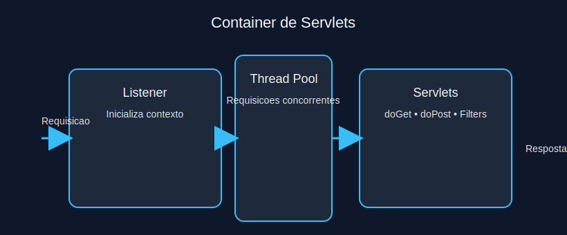
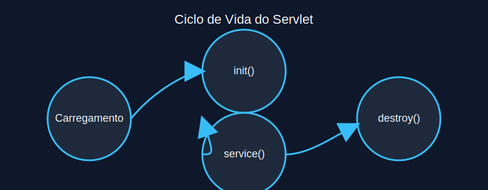
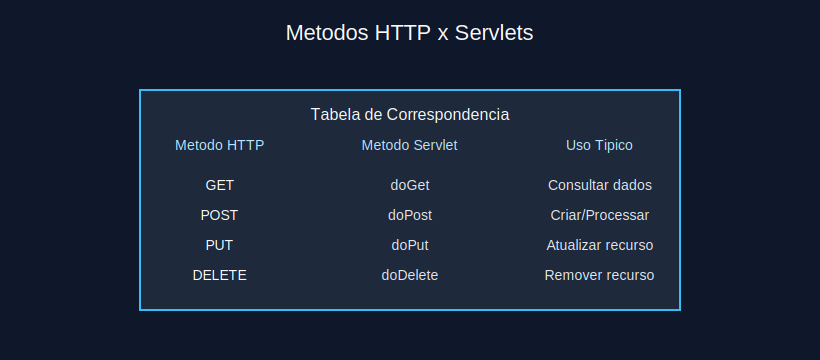
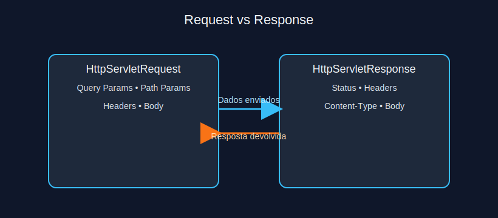
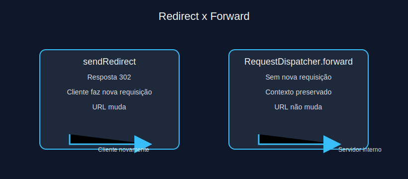
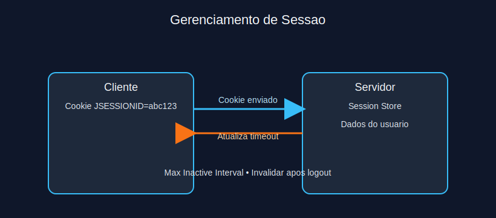

# Modulo 2 - Servlets

## Sumario Navegavel
- [Introducao ao Modulo](#introducao-ao-modulo)
- [3.1 Definicao de Servlets](#31-definicao-de-servlets)
- [3.2 Ciclo de Vida](#32-ciclo-de-vida)
- [3.3 Tratamento de Requisicoes GET e POST](#33-tratamento-de-requisicoes-get-e-post)
- [3.4 Parametros e Respostas](#34-parametros-e-respostas)
- [3.5 Redirecionamento e Encaminhamento](#35-redirecionamento-e-encaminhamento)
- [3.6 Sessoes](#36-sessoes)

## Introducao ao Modulo
Neste modulo voce vai entender o nucleo da especificacao Java Servlet, pilar para frameworks como Spring MVC. Dominando ciclo de vida, manipulacao de requisicoes e gerenciamento de sessao, torna-se possivel criar APIs HTTP robustas e seguras.

## 3.1 Definicao de Servlets
Servlets sao componentes Java executados em um container (Tomcat, Jetty, Undertow) responsáveis por tratar requisicoes HTTP. Eles estendem `HttpServlet` e substituem metodos como `doGet` e `doPost` para prover respostas customizadas.



**Exercicio 2.1:** Qual responsabilidade pertence ao container de servlets?
a) Compilar o codigo Java do cliente

b) Gerenciar ciclo de vida dos servlets e despachar requisicoes

c) Renderizar o DOM no navegador

d) Controlar layout CSS

<details>
<summary>Ver Resposta</summary>

**Resposta:** b) Gerenciar ciclo de vida dos servlets e despachar requisicoes

**Explicacao:** O container carrega, inicializa e invoca servlets conforme novas requisicoes chegam, alem de prover infraestrutura de threads, seguranca e configuracao.
</details>

## 3.2 Ciclo de Vida
O ciclo de vida envolve tres momentos principais: `init()`, chamado uma unica vez; `service()` (e seus wrappers `doGet`, `doPost`, etc.), chamado a cada requisicao; e `destroy()`, executado quando o servlet e descarregado. Recursos pesados devem ser inicializados em `init` e liberados em `destroy`.



```java
@WebServlet("/relatorios")
public class RelatorioServlet extends HttpServlet {

  private RelatorioService service;

  @Override
  public void init() {
    this.service = new RelatorioService();
  }

  @Override
  protected void doGet(HttpServletRequest req, HttpServletResponse resp) throws IOException {
    resp.setContentType("application/json");
    resp.getWriter().write(service.gerarResumo());
  }

  @Override
  public void destroy() {
    service.close();
  }
}
```

**Exercicio 2.2:** Onde e recomendavel criar conexoes ou caches reutilizados por todo o servlet?
a) Dentro de cada chamada `doGet`

b) Dentro de cada bloco `try-catch`

c) No metodo `init()`

d) No metodo `destroy()`

<details>
<summary>Ver Resposta</summary>

**Resposta:** c) No metodo `init()`

**Explicacao:** `init()` e executado apenas uma vez por instancia, ideal para inicializar recursos reutilizaveis. Criar conexoes a cada requisicao aumenta custo e risco de vazamento.
</details>

## 3.3 Tratamento de Requisicoes GET e POST
GET busca recursos sem alterar estado; POST envia dados para processamento. No servlet, esses verbos sao tratados sobrescrevendo `doGet()` ou `doPost()`, respeitando semantica HTTP. Chamadas GET nao devem modificar dados persistidos.



**Exercicio 2.3:** Qual situacao deve usar `doPost`?
a) Carregar pagina inicial da aplicacao

b) Submeter formulario de cadastro de usuario

c) Buscar lista de produtos sem filtros

d) Entregar arquivo CSS estatico

<details>
<summary>Ver Resposta</summary>

**Resposta:** b) Submeter formulario de cadastro de usuario

**Explicacao:** POST indica envio de dados que podem alterar o estado no servidor. Requisicoes de leitura ou recursos estaticos devem usar GET.
</details>

## 3.4 Parametros e Respostas
`HttpServletRequest` oferece acesso a parametros de query (`getParameter`, `getParameterMap`) e corpo (`getReader`). `HttpServletResponse` controla status codes, cabecalhos e corpo da resposta. Sempre defina `Content-Type` adequado e encode compatível (`setCharacterEncoding`).



**Exercicio 2.4:** Como retornar JSON devidamente identificado?
a) `resp.setStatus(404);`

b) `resp.setContentType("application/json"); resp.getWriter().write(json);`

c) `req.getSession().setAttribute("data", json);`

d) `resp.sendError(500, json);`

<details>
<summary>Ver Resposta</summary>

**Resposta:** b) `resp.setContentType("application/json"); resp.getWriter().write(json);`

**Explicacao:** Para enviar JSON, configure o `Content-Type` apropriado e escreva o corpo da resposta. As demais opcoes nao retornam JSON com sucesso.
</details>

## 3.5 Redirecionamento e Encaminhamento
`sendRedirect` envia ao cliente novo codigo de status (302) instruindo-o a requisitar outra URL. `RequestDispatcher#forward` executa encaminhamento interno no servidor reutilizando a mesma requisicao. Use redirect para mudar o contexto do cliente, e forward para transferir processamento interno.



**Exercicio 2.5:** Quando `forward` e preferivel a `sendRedirect`?
a) Ao enviar usuario para dominio externo

b) Ao reutilizar dados da mesma requisicao para renderizar JSP

c) Ao limpar cookies do navegador

d) Ao indicar que recurso foi criado (status 201)

<details>
<summary>Ver Resposta</summary>

**Resposta:** b) Ao reutilizar dados da mesma requisicao para renderizar JSP

**Explicacao:** `forward` preserva atributos e parametros da requisicao original. `sendRedirect` instruiria o cliente a iniciar nova conexao, perdendo contexto.
</details>

## 3.6 Sessoes
Sessoes HTTP guardam estado entre requisicoes usando cookies (`JSESSIONID`) ou rescrita de URL. Servlets oferecem `HttpSession` para armazenar atributos, definir expiracao (`setMaxInactiveInterval`) e invalidar sessao. Evite armazenar objetos grandes ou sensiveis sem criptografia.



**Exercicio 2.6:** Qual boa pratica evita vazamento de sessao?
a) Manter objetos File abertos na sessao

b) Chamar `session.invalidate()` apos logout

c) Compartilhar a mesma sessao entre usuarios

d) Guardar senhas em texto puro na sessao

<details>
<summary>Ver Resposta</summary>

**Resposta:** b) Chamar `session.invalidate()` apos logout

**Explicacao:** Invalidate remove atributos e expira a sessao, reduzindo risco de reutilizacao indevida. As demais opcoes expõem o sistema a falhas de seguranca e recursos.
</details>

---

[Proximo modulo ->](modulo_03_java_server_pages.md)  
[Voltar aos Links Rapidos](../README.md#links-rapidos)
