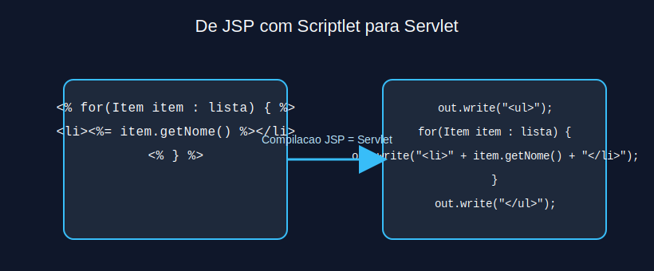
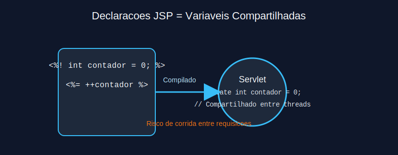
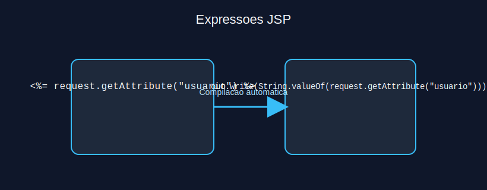
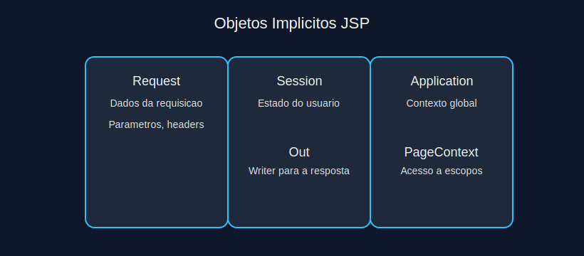
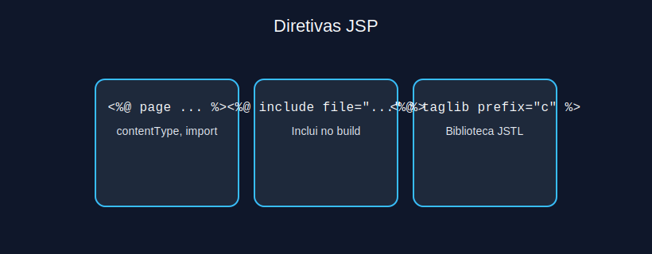
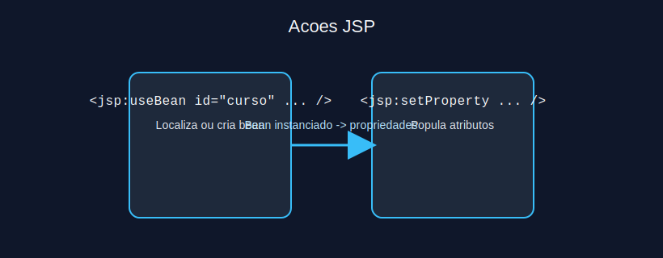
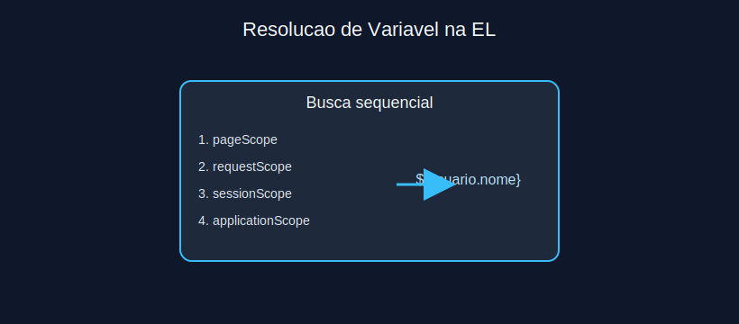
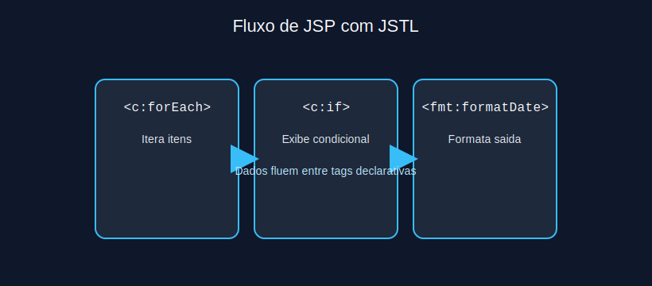

# Modulo 3 - Java Server Pages (JSP)

## Sumario Navegavel
- [Introducao ao Modulo](#introducao-ao-modulo)
- [4.1 Scriptlets](#41-scriptlets)
- [4.2 Declaracoes](#42-declaracoes)
- [4.3 Expressoes](#43-expressoes)
- [4.4 Objetos Implicitos](#44-objetos-implicitos)
- [5.1 Diretivas](#51-diretivas)
- [5.2 Acoes JSP](#52-acoes-jsp)
- [5.3 Linguagem de Expressao (EL)](#53-linguagem-de-expressao-el)
- [5.4 Biblioteca de Tags Padrao (JSTL)](#54-biblioteca-de-tags-padrao-jstl)

## Introducao ao Modulo
Este modulo aprofunda o uso de JSP como tecnologia de apresentacao sobre servlets. Exploramos scriptlets, EL e JSTL, destacando as melhores praticas para manter o codigo limpo, seguro e de facil manutencao.

## 4.1 Scriptlets
Scriptlets permitem inserir codigo Java dentro do HTML usando `<% ... %>`. Apesar de funcionais, seu uso deve ser limitado para logica simples, favorecendo JSTL e EL para separar apresentacao e regra de negocio.



```jsp
<ul>
<% for (String item : (List<String>) request.getAttribute("itens")) { %>
  <li><%= item %></li>
<% } %>
</ul>
```

**Exercicio 3.1:** Por que scriptlets sao desencorajados em projetos modernos?
a) Porque JSP nao compila scriptlets

b) Porque dificultam a separacao de responsabilidades e a reutilizacao

c) Porque nao podem acessar atributos de request

d) Porque apenas funcionam com Tomcat

<details>
<summary>Ver Resposta</summary>

**Resposta:** b) Porque dificultam a separacao de responsabilidades e a reutilizacao

**Explicacao:** Scriptlets misturam Java e HTML, reduzindo clareza e dificultando manutencao. Tecnicas mais modernas usam JSTL, EL e frameworks MVC.
</details>

## 4.2 Declaracoes
Declaracoes (`<%! ... %>`) permitem definir metodos ou variaveis de instancia no servlet gerado. Devem ser usados com cautela porque sao compartilhados entre threads.



**Exercicio 3.2:** Qual risco esta associado a declaracoes JSP?
a) Elas impedem a pagina de compilar

b) Variaveis de instancia podem ser acessadas por multiplas threads simultaneamente

c) Elas substituem o uso de EL

d) Elas bloqueiam a integracao com JSTL

<details>
<summary>Ver Resposta</summary>

**Resposta:** b) Variaveis de instancia podem ser acessadas por multiplas threads simultaneamente

**Explicacao:** Declaracoes sao convertidas em membros do servlet e compartilhadas; sem sincronizacao, podem ocorrer race conditions.
</details>

## 4.3 Expressoes
Expressoes (`<%= ... %>`) avaliam uma expressao e escrevem o resultado diretamente na resposta. Sao uteis para inserir valores simples sem precisar de scriptlets extensos.



**Exercicio 3.3:** Qual sintaxe imprime o atributo `usuario` da request?
a) `<%= request.getAttribute("usuario") %>`

b) `<% request.getAttribute("usuario"); %>`

c) `<%! request.getAttribute("usuario"); %>`

d) `${request.usuario}`

<details>
<summary>Ver Resposta</summary>

**Resposta:** a) `<%= request.getAttribute("usuario") %>`

**Explicacao:** A sintaxe `<%=` imprime o resultado diretamente na resposta. Opcao d) utiliza EL, que tambem funciona, mas nao segue o formato de scriptlet.
</details>

## 4.4 Objetos Implicitos
JSP disponibiliza objetos implicitos como `request`, `response`, `session`, `application`, `out`, `config` e `pageContext`. Eles permitem acessar contexto e dados sem declaracoes adicionais.



**Exercicio 3.4:** Qual objeto implicito representa o escopo de aplicacao?
a) `request`

b) `session`

c) `application`

d) `pageContext`

<details>
<summary>Ver Resposta</summary>

**Resposta:** c) `application`

**Explicacao:** `application` referencia o `ServletContext`, compartilhado por toda a aplicacao. `request` e por requisicao, `session` por usuario e `pageContext` por pagina.
</details>

## 5.1 Diretivas
Diretivas configuram a pagina JSP. As principais sao `page`, `include` e `taglib`. Elas definem importacoes, tratam encodings e incluem outros arquivos no tempo de compilacao.



```jsp
<%@ page contentType="text/html; charset=UTF-8" %>
<%@ page import="java.time.LocalDate" %>
<p>Data atual: <%= LocalDate.now() %></p>
```

**Exercicio 3.5:** Qual diretiva controla a codificacao da resposta?
a) `<%@ taglib %>`

b) `<%@ page %>`

c) `<%@ include %>`

d) `<%@ coding %>`

<details>
<summary>Ver Resposta</summary>

**Resposta:** b) `<%@ page %>`

**Explicacao:** A diretiva `page` permite definir `contentType`, `pageEncoding` e importacoes. `taglib` registra bibliotecas de tags, `include` inclui arquivos.
</details>

## 5.2 Acoes JSP
Acoes sao elementos XML (`<jsp:useBean>`, `<jsp:setProperty>`, `<jsp:include>`, etc.) interpretados pelo container em tempo de execucao. Permitem instanciar beans, encaminhar requisicoes e manipular propriedades sem escrever scriptlets.



**Exercicio 3.6:** Qual acao instancia um JavaBean se necessario?
a) `<jsp:forward />`

b) `<jsp:include />`

c) `<jsp:useBean />`

d) `<jsp:setProperty />`

<details>
<summary>Ver Resposta</summary>

**Resposta:** c) `<jsp:useBean />`

**Explicacao:** `jsp:useBean` localiza ou cria um bean no escopo solicitado. `jsp:setProperty` atribui valores, `jsp:forward` encaminha requisicoes e `jsp:include` inclui recursos.
</details>

## 5.3 Linguagem de Expressao (EL)
EL simplifica o acesso a atributos de escopo usando sintaxe `${}`. Suporta operacoes logicas, aritmeticas e acesso a propriedades (`${usuario.nome}`). EL deve substituir scriptlets para exibir dados.



```jsp
<p>Bem-vindo, ${usuario.nome}!</p>
<c:if test="${empty pedidos}">
  <p>Nenhum pedido encontrado.</p>
</c:if>
```

**Exercicio 3.7:** Como acessar o atributo `carrinho.total` usando EL?
a) `${carrinho["total"]}`

b) `${carrinho.total}`

c) `<%= carrinho.getTotal() %>`

d) `${requestScope.carrinho().total()}`

<details>
<summary>Ver Resposta</summary>

**Resposta:** b) `${carrinho.total}`

**Explicacao:** EL usa notacao ponto para acessar propriedades JavaBean. Opcao a) tambem funcionaria, mas notacao ponto e mais comum. Opcao c) e scriptlet; d) usa sintaxe invalida.
</details>

## 5.4 Biblioteca de Tags Padrao (JSTL)
JSTL oferece tags para controle de fluxo (`c:if`, `c:forEach`), formatacao (`fmt`), funcoes (`fn`) e acesso a SQL (desencorajado em producao). Utilize JSTL para reduzir scriptlets e manter a camada de apresentacao declarativa.



**Exercicio 3.8:** Qual tag JSTL percorre colecoes?
a) `<c:forEach>`

b) `<c:redirect>`

c) `<fmt:formatDate>`

d) `<sql:query>`

<details>
<summary>Ver Resposta</summary>

**Resposta:** a) `<c:forEach>`

**Explicacao:** `c:forEach` itera listas e arrays, permitindo acesso a cada item. `c:redirect` redireciona, `fmt:formatDate` formata datas e `sql:query` executa SQL.
</details>

---

[Proximo modulo ->](modulo_04_arquitetura_mvc_e_padroes_de_projeto.md)  
[Voltar aos Links Rapidos](../README.md#links-rapidos)
