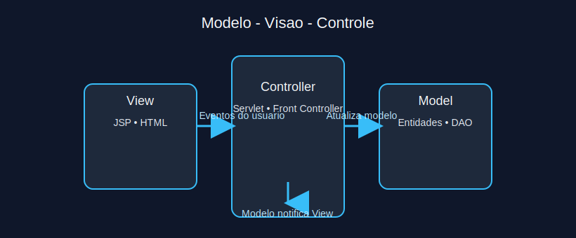
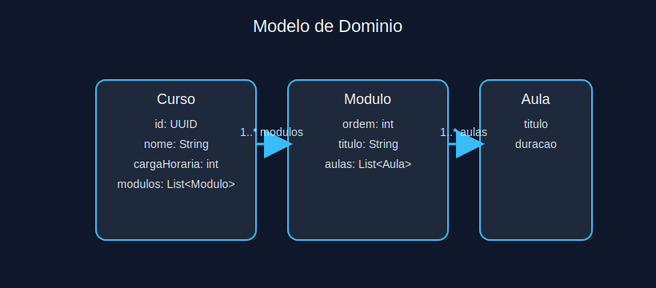
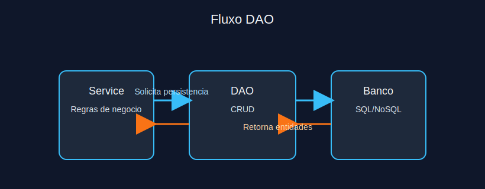
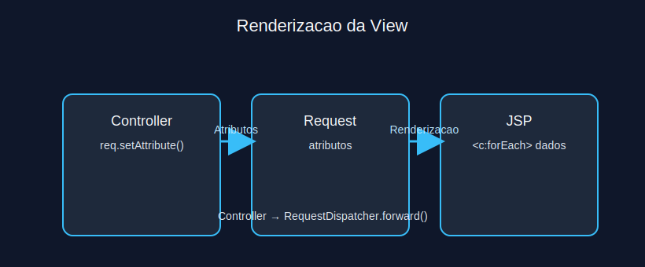
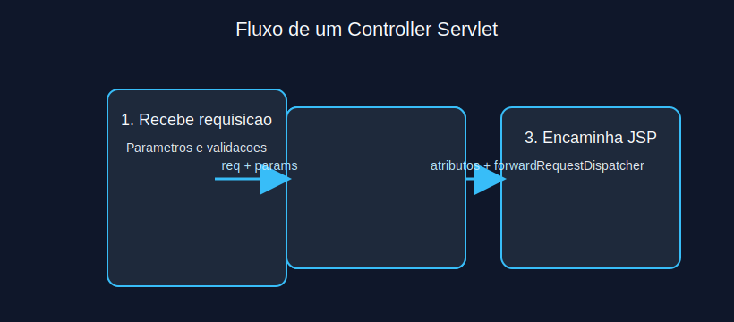

# Modulo 4 - Arquitetura MVC e Padrões de Projeto

## Sumario Navegavel
- [Introducao ao Modulo](#introducao-ao-modulo)
- [6.1 Visao Geral](#61-visao-geral)
- [6.2 Camada Modelo](#62-camada-modelo)
- [6.3 Camada de Acesso a Dados (DAO)](#63-camada-de-acesso-a-dados-dao)
- [6.4 Camada Visao](#64-camada-visao)
- [6.5 Camada Controle](#65-camada-controle)

## Introducao ao Modulo
Neste modulo consolidamos o padrao Model-View-Controller aplicado a aplicacoes Java web, mostrando como separar responsabilidades, aplicar o padrao DAO e integrar JSP como camada de apresentacao.

## 6.1 Visao Geral
O MVC organiza o sistema em Modelo (dados e regra de negocio), Visao (interface) e Controle (intermediario). Essa separacao melhora testabilidade, troca de camadas e manutencao.



**Exercicio 4.1:** Qual beneficio direto do MVC?
a) Aumentar o acoplamento entre componentes

b) Permitir troca de camadas sem afetar demais partes

c) Eliminar necessidade de testes

d) Executar JavaScript no servidor

<details>
<summary>Ver Resposta</summary>

**Resposta:** b) Permitir troca de camadas sem afetar demais partes

**Explicacao:** MVC reduz acoplamento, permitindo evolucao independente das camadas. Nao elimina testes nem move JavaScript para o servidor.
</details>

## 6.2 Camada Modelo
O Modelo abrange entidades, objetos de dominio e regras de negocio. Deve encapsular validacoes e logica independente de tecnologia de apresentacao. Em Java, classes POJO com metodos e invariantes compoem essa camada.



```java
public class Pedido {
  private final UUID id;
  private final List<ItemPedido> itens;

  public Pedido(UUID id, List<ItemPedido> itens) {
    if (itens.isEmpty()) {
      throw new IllegalArgumentException("Pedido deve possuir itens");
    }
    this.id = id;
    this.itens = List.copyOf(itens);
  }

  public BigDecimal calcularTotal() {
    return itens.stream()
        .map(ItemPedido::calcularSubtotal)
        .reduce(BigDecimal.ZERO, BigDecimal::add);
  }
}
```

**Exercicio 4.2:** Qual responsabilidade e tipica do Modelo?
a) Renderizar HTML

b) Gerenciar conexoes JDBC diretamente

c) Implementar regras de negocio e invariantes

d) Disparar requests HTTP

<details>
<summary>Ver Resposta</summary>

**Resposta:** c) Implementar regras de negocio e invariantes

**Explicacao:** O Modelo encapsula logicas essenciais de negocio. Renderizacao pertence a Visao; conexoes e integracoes sao responsabilidade de camadas de infraestrutura como DAO ou servicos.
</details>

## 6.3 Camada de Acesso a Dados (DAO)
DAO (Data Access Object) abstrai interacoes com o banco de dados, oferecendo metodos especificos para consultar e persistir entidades. Ajuda a desacoplar o modelo de detalhes de persistencia (SQL, JPA, NoSQL).



```java
public interface PedidoDao {
  Optional<Pedido> buscarPorId(UUID id);
  void salvar(Pedido pedido);
}

public class PedidoJdbcDao implements PedidoDao {
  private final DataSource dataSource;

  public PedidoJdbcDao(DataSource dataSource) {
    this.dataSource = dataSource;
  }

  @Override
  public Optional<Pedido> buscarPorId(UUID id) {
    // Implementacao omitida
    return Optional.empty();
  }
}
```

**Exercicio 4.3:** Qual vantagem do padrao DAO?
a) Evitar teste unitario

b) Permitir troca de tecnologia de banco sem alterar regras de negocio

c) Eliminar necessidade de transacoes

d) Forcar uso de SQL puro

<details>
<summary>Ver Resposta</summary>

**Resposta:** b) Permitir troca de tecnologia de banco sem alterar regras de negocio

**Explicacao:** DAO encapsula detalhes de acesso a dados, facilitando a troca de implementacoes (JDBC, JPA, NoSQL) sem impactar camadas superiores.
</details>

## 6.4 Camada Visao
Na camada de visao, JSP, Thymeleaf ou outras ferramentas renderizam dados do modelo para o usuario. A visao deve conter apenas logica de apresentacao, usando JSTL/EL, evitando scriptlets.



**Exercicio 4.4:** O que deve ser evitado em uma JSP bem estruturada?
a) Uso de JSTL para iterar colecoes

b) Logica de regra de negocio implementada com scriptlets

c) Definicao de layout responsivo com CSS

d) Uso de EL para exibir atributos

<details>
<summary>Ver Resposta</summary>

**Resposta:** b) Logica de regra de negocio implementada com scriptlets

**Explicacao:** JSP deve focar apresentacao. Regras de negocio devem residir no Modelo ou no Controlador.
</details>

## 6.5 Camada Controle
O Controlador recebe requisicoes, interage com Modelo/DAO e escolhe a visao apropriada. Em Java EE, um servlet pode atuar como Controller, definindo atributos na request e encaminhando para JSP.



```java
@WebServlet("/pedidos")
public class PedidoController extends HttpServlet {
  private PedidoService service;

  @Override
  public void init() {
    this.service = (PedidoService) getServletContext().getAttribute("pedidoService");
  }

  @Override
  protected void doGet(HttpServletRequest req, HttpServletResponse resp) throws ServletException, IOException {
    req.setAttribute("pedidos", service.listarTodos());
    req.getRequestDispatcher("/WEB-INF/views/pedidos.jsp").forward(req, resp);
  }
}
```

**Exercicio 4.5:** Qual metodo do controlador escolhe a visao final?
a) `response.sendError`

b) `request.getRequestDispatcher(...).forward(...)`

c) `service.calcularTotal()`

d) `dao.salvar()`

<details>
<summary>Ver Resposta</summary>

**Resposta:** b) `request.getRequestDispatcher(...).forward(...)`

**Explicacao:** O controlador define atributos e usa `forward` para renderizar a visao correta. Os demais metodos tem outras responsabilidades.
</details>

---

[Proximo modulo ->](modulo_05_projeto_de_conclusao.md)  
[Voltar aos Links Rapidos](../README.md#links-rapidos)
