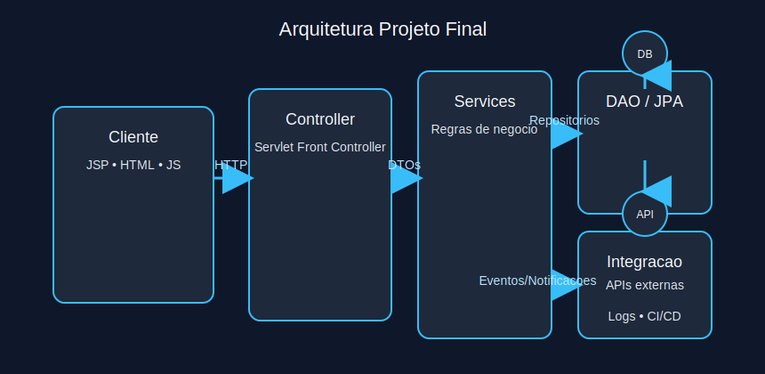

# Modulo 5 - Projeto de Conclusao de Curso

## Sumario Navegavel
- [Introducao ao Modulo](#introducao-ao-modulo)
- [7.1 Desenvolvimento Integrado](#71-desenvolvimento-integrado)

## Introducao ao Modulo
O modulo final integra todos os conceitos: aplicacao web, servlets, JSP, MVC e padrao DAO. Voce ira arquitetar uma solucao completa, da camada de apresentacao ao acesso a dados.

## 7.1 Desenvolvimento Integrado
O projeto consolidado deve incluir:

1. **Requisitos Funcionais**
   - Cadastro e autenticacao de usuarios.
   - Fluxo CRUD para recursos principais (ex: cursos, aulas, matriculas).
   - Painel administrativo com relatorios.

2. **Arquitetura**
   - Servlet acting como controlador central (Front Controller).
   - JSPs com JSTL/EL para apresentacao.
   - DAOs encapsulando acesso ao banco (JDBC ou JPA).
   - Servicos intermediando regras de negocio.

3. **Boas Praticas**
   - Validacao no servidor e feedback no cliente.
   - Tratamento de erros com paginas dedicadas.
   - Testes unitarios para servicos e DAOs (Mockito, H2).
   - Configuracao do build (Maven/Gradle) e guidelines de deploy.

**Exercicio 5.1:** Qual combinacao garante separacao de responsabilidades no projeto final?
a) JSP acessando diretamente o banco via JDBC

b) Servlet recebendo requisicao, chamando servico e encaminhando para JSP

c) DAO renderizando HTML com dados

d) Service enviando resposta JSON diretamente ao navegador

Ver Resposta

**Resposta:** b) Servlet recebendo requisicao, chamando servico e encaminhando para JSP

**Explicacao:** O controlador orquestra fluxo, os servicos aplicam regras e JSP renderiza. As outras opcoes quebram limites do MVC.

---

[Voltar aos Links Rapidos](../README.md#links-rapidos)
